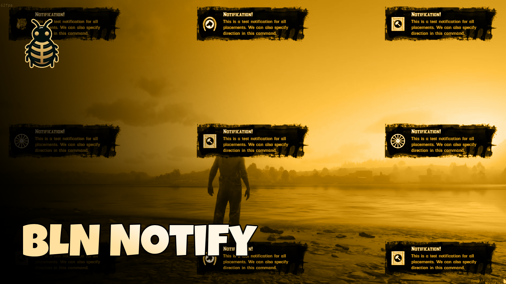

# BLN Notify



A standalone, flexible, and customizable notification system for RedM servers.

[Video Preview](https://youtu.be/zwK8LLuFDVE)

## ✨ Features

- 🌐 RTL (Right-to-Left) support for multilingual notifications
- 📚 Predefined templates for easily reusable notifications
- 🧭 Support for all directions (9 placement options)
- 📱 Responsive design for various screen sizes
- 🎛️ Support for both advanced and simple notifications
- 🌈 Customizable colors for title and description
- 🖼️ Option to use background or transparent notifications
- 🎭 Flexible icon support (URL or game texture hashnames)
- ⏱️ Customizable duration for each notification
- 🔀 Adjustable content alignment (start, center, end)
- 🎬 Animated entrance and exit effects
- 🖥️ Both client-side and server-side triggering options
- 🛠️ Easy to integrate with existing resources
- 🎮 Designed specifically for RedM servers (Standalone)

## Documentation

### Client-Side Usage

To send a notification from the client-side:

```lua
TriggerEvent("bln_notify:send", options)

OR

TriggerEvent("bln_notify:send", options, template)
```

#### Example
```lua
TriggerEvent("bln_notify:send", {
    title = "Hello!",
    description = "This is a basic notification.",
    icon = "generic_list",
    placement = "middle-right"
})

OR

-- With Template
TriggerEvent("bln_notify:send", {
    description = "This is a success template notification.",
    placement = "middle-right"
}, "SUCCESS")
```

### Server-Side Usage

To send a notification from the server-side:

```lua
TriggerEvent("bln_notify:send", source, options)

OR

TriggerEvent("bln_notify:send", source, options, template)
```

#### Example
```lua
TriggerEvent("bln_notify:send", source, {
    title = "Hello!",
    description = "This is a basic notification.",
    icon = "generic_list",
    placement = "middle-right"
})

OR

-- With Template
TriggerEvent("bln_notify:send", source, {
    description = "This is a success template notification.",
    placement = "middle-right"
}, "SUCCESS")
```

### Notification Options

The `options` table can include the following properties:

| Option | Description | Default | Required/Optional |
|--------|-------------|---------|-------------------|
| placement | Position of the notification | "top-right" | Optional |
| title | Title of the notification | "Notification" | Required |
| description | Description text for the notification | null | Optional |
| duration | Time in milliseconds before the notification is automatically removed | 5000 | Optional |
| icon | Icon name (details bellow) or URL for the notification | null | Optional |
| useBackground | Whether to use the background image | true | Optional |
| contentAlignment | Alignment of the content | "start" | Optional |
| isRTL | Right-to-left text direction | false | Optional |
| titleColor | Custom color for the title | undefined | Optional |
| descriptionColor | Custom color for the description | undefined | Optional |

### Templates

Predefined templates are available in the `Config.Templates` by default:

- `INFO`
- `SUCCESS`
- `ERROR`
- `TIP`

You can use these templates by passing the template name as the second argument in the TriggerEvent call. You can create as many templates as you want in `config.lua` to easily reuse them later.

### Placement Options

Available placement options are:

- "top-right"
- "top-center"
- "top-left"
- "middle-right"
- "middle-center"
- "middle-left"
- "bottom-right"
- "bottom-center"
- "bottom-left"

### Content Alignment Options

Available content alignment options are:

- "start"
- "center"
- "end"

### Icon Options

Icons can be specified in two ways:
1. Using a full URL path to an image
2. Using an icon hashname from the RDR3 discoveries repository

When using an icon hashname, you can reference icons from this list:
https://github.com/femga/rdr3_discoveries/blob/master/useful_info_from_rpfs/textures/ui_textures_mp____part1/README.md#inventory_items_mp-0xdeb345d8

use `hashname` only from `inventory_items_mp` list.

#### Example on icons
```lua

icon = "generic_list", -- hashname.
OR 
icon = "nui://resource_name/imgs/example.png",
OR
icon = "https://example.com/path/to/imgs/example.png",

```

### Advanced Example

```lua
-- Advanced Customizations
TriggerEvent("bln_notify:send", {
    title = "Custom Notification",
    description = "This notification has custom styling.",
    icon = "generic_bundle_crafting",
    placement = "middle-center",
    duration = 10000,
    useBackground = false,
    contentAlignment = "center",
    isRTL = true,
    titleColor = "#FF5733",
    descriptionColor = "rgba(255, 255, 255, 0.8)"
})
```
These examples demonstrate different ways to use the BLN Notify system, including various placement options, custom colors, different icon specifications, and other available options.

### Demo Commands (examples)

The following commands are available for testing the notification system:

- `/bln_notify_allAdvanced [RTL]`: Show notifications in all placements
- `/bln_notify_allTips [RTL] [icon]`: Show tip notifications in all placements
- `/bln_notify_info [placement]`: Show an INFO notification
- `/bln_notify_success [placement]`: Show a SUCCESS notification
- `/bln_notify_error [placement]`: Show an ERROR notification
- `/bln_notify [placement]`: Show a custom notification
- `/bln_notify_tip [placement] [icon]`: Show a TIP notification

These commands are defined in the `client/_Examples.lua` file and include chat suggestions for ease of use.


## Support

If you encounter any issues or have questions, go to [Discord for help](discord.com/invite/MEZRYQVpnt) or open an issue on the GitHub repository.

## Contributing

Contributions to improve the resource are welcome. Please feel free to submit pull requests or create issues for bugs and feature requests.